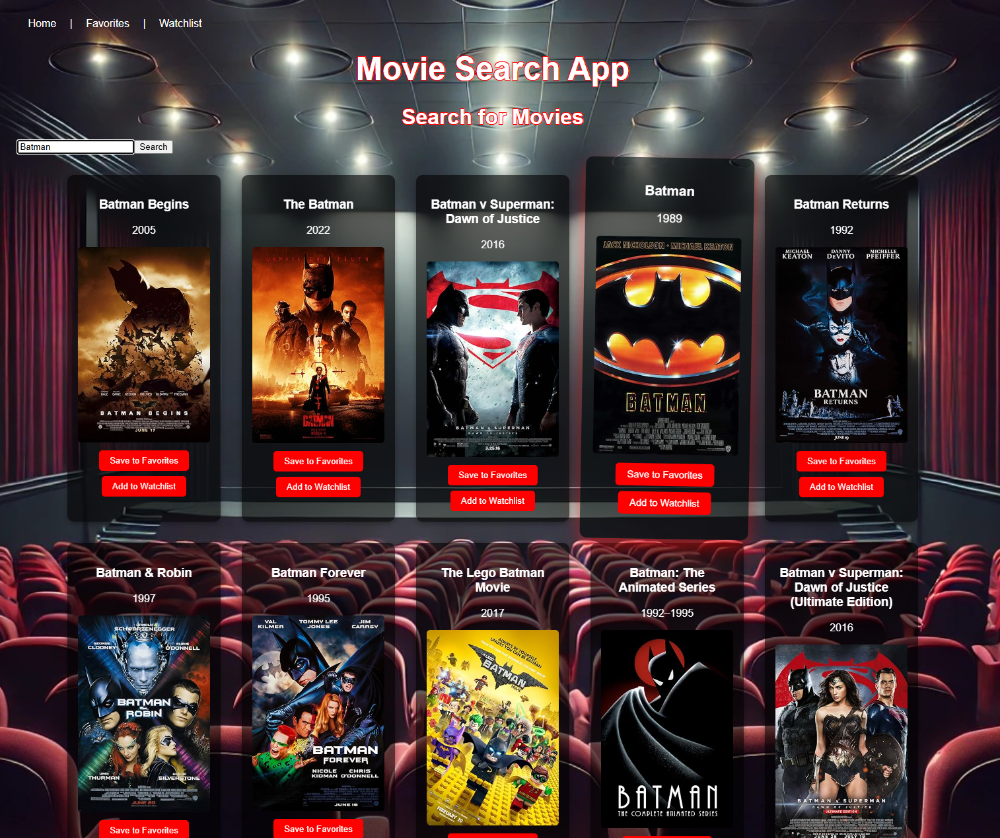
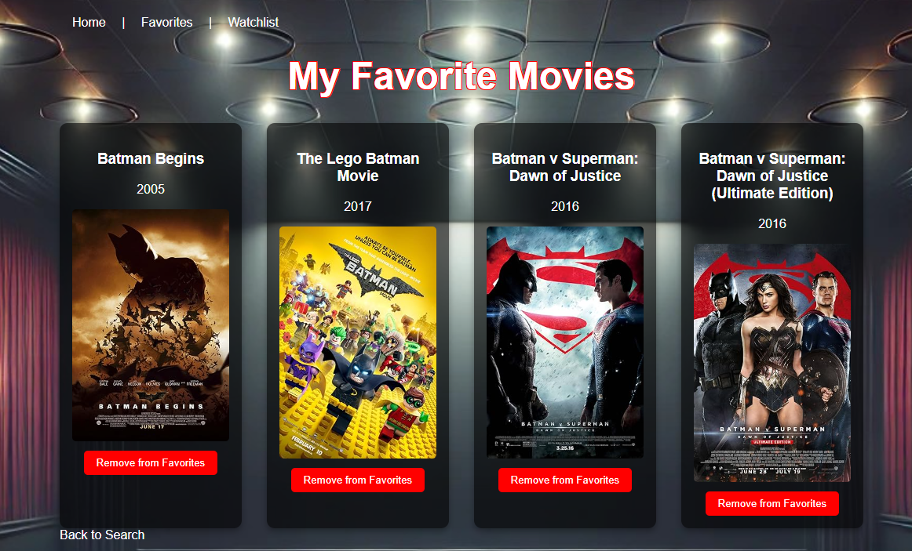
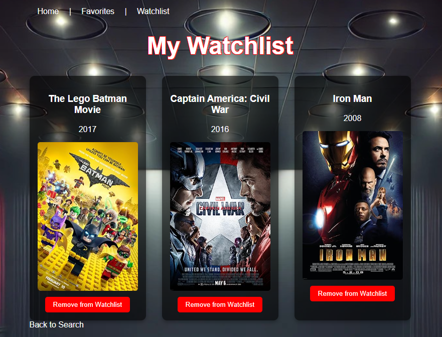

# 🎬 Movie Search App

A simple React app to search movies, save favorites, and organize a watchlist.

This project was a practice app I built after learning React — designed to help me learn React basics, routing, and working with APIs.

## 🚀 Features
- Search movies using the OMDb API
- Save movies to your **Favorites**
- Add movies to your **Watchlist**
- Remove movies from either list
- Persistent storage using **localStorage**
- Clean and simple design

## 📸 Demo Screenshots

### Home Page

### Movie Search Results

### Favorites Page

### Watchlist Page

## 📂 Tech Stack
- React
- React Router
- OMDb API
- Local Storage
- Basic CSS

---
